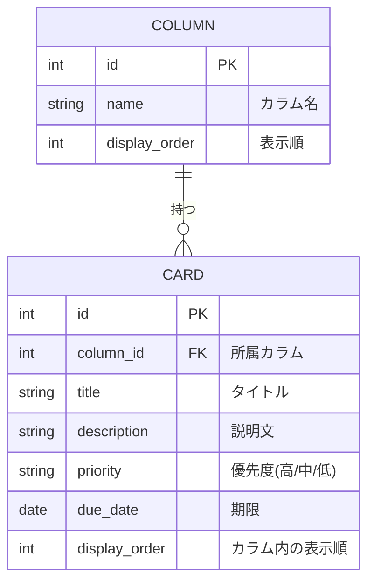

# データベース設計 - Trello風タスク管理アプリ

[要件定義書](requirements.md) に対応するデータベース設計詳細ドキュメント。

## 1. ER図

## 2. テーブル定義

**columns テーブル**

| カラム名 | 型 | PK | FK | NULL | デフォルト | 説明 |
|---|---|---|---|---|---|---|
| id | INTEGER | ○ | | NOT NULL | 自動採番 | カラムID |
| name | VARCHAR(50) | | | NOT NULL | - | カラム名 |
| display_order | INTEGER | | | NOT NULL | - | 表示順 |
| created_at | DATETIME | | | NOT NULL | 作成時刻 | 作成日時 |
| updated_at | DATETIME | | | NOT NULL | 作成時刻 | 更新日時(レコード更新時に上書き) |

**cards テーブル**

| カラム名 | 型 | PK | FK | NULL | デフォルト | 説明 |
|---|---|---|---|---|---|---|
| id | INTEGER | ○ | | NOT NULL | 自動採番 | カードID |
| column_id | INTEGER | | ○(columns.id) | NOT NULL | - | 所属カラム |
| title | VARCHAR(100) | | | NOT NULL | - | タイトル |
| description | TEXT | | | NULL可 | - | 説明文 |
| priority | VARCHAR(10) | | | NOT NULL | "中" | 優先度(高/中/低) |
| due_date | DATE | | | NULL可 | - | 期限 |
| display_order | INTEGER | | | NOT NULL | - | カラム内の表示順 |
| created_at | DATETIME | | | NOT NULL | 作成時刻 | 作成日時 |
| updated_at | DATETIME | | | NOT NULL | 作成時刻 | 更新日時(レコード更新時に上書き) |

- `cards.column_id` は `columns.id` への外部キー。カラム削除時は、そのカラムに属するカードも連動して削除する(カスケード削除)。

## 3. 補足

- ボードは1つのみのため、ボードをエンティティとしては持たない(カラム・カードのみで管理する)。
- カード・カラムそれぞれに表示順(`display_order`)を持たせ、ドラッグ&ドロップによる並べ替えを可能にする。
- `order` はSQLの予約語(ORDER BY)であるため、カラム名としては使用せず `display_order` とする。
- カードは必ずいずれか1つのカラムに属する(1カラム:多カード)。
- スキーマはHibernateの `ddl-auto: update` により、エンティティ定義から自動生成される(Flyway/Liquibase等のバージョン管理されたmigrationは未導入。導入方針は[技術スタック](tech-stack.md)を参照)。
- アプリ起動時に `data.sql` によりカラム3件(未着手/進行中/完了)・サンプルカード5件のシードデータが投入される(`spring.sql.init.mode: always`)。
