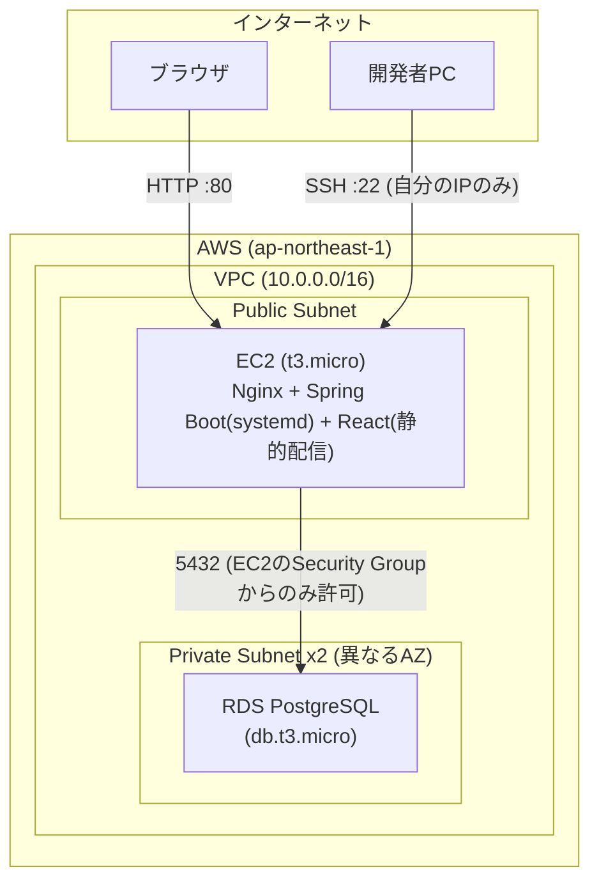
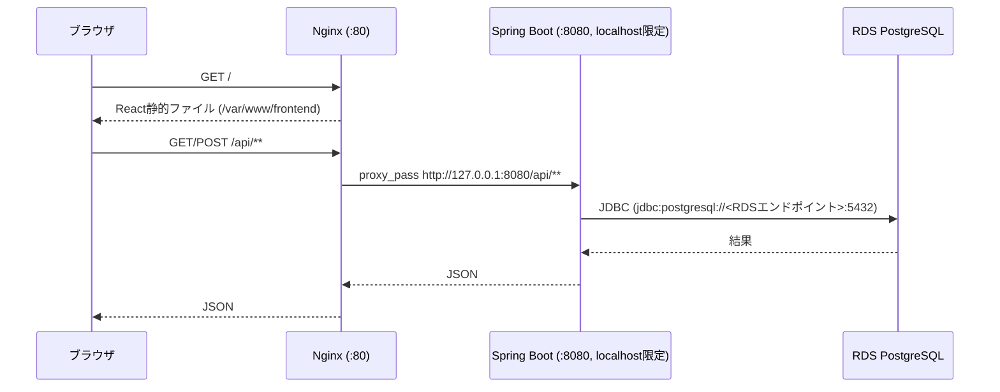

# インフラ構成

本アプリケーションはAWS上に、AWS CLI認証 + Terraform(IaC)によってデプロイする。マネジメントコンソールの手動操作ではなく、`infra/`配下のTerraformコードでインフラを再現可能な形で管理する。

## 構成方針

学習・検証段階のため、まずは最小構成で「動く」ことを優先する。

- フロントエンド・バックエンドは同一のEC2インスタンスに同居させる（S3+CloudFrontによる分離は将来検討）
- データベースはRDS(PostgreSQL)を別途用意し、EC2からのみ接続可能にする
- Nginxをリバースプロキシとして導入し、フロントエンドの静的配信とバックエンドAPIへの振り分けを行う

## 構成図



## リクエストの流れ



## AWS上のリソース

| リソース | 役割 |
|---|---|
| VPC | 全体を包むネットワーク境界 |
| Public Subnet | EC2を配置。インターネットゲートウェイ経由で外部からアクセス可能 |
| Private Subnet x2 | RDS用。RDSのDBサブネットグループは異なるAZのサブネットを2つ以上要求するため2つ用意 |
| EC2 (t3.micro) | フロントエンド・バックエンドを同居させるアプリケーションサーバー |
| RDS (PostgreSQL, db.t3.micro) | アプリケーションのデータベース。`publicly_accessible=false`でインターネットから隔離 |
| Security Group (EC2用) | SSH(22)は自分のIPのみ、HTTP(80)は全許可。バックエンドのポート(8080)は外部に公開せずNginx経由のみ |
| Security Group (RDS用) | EC2のSecurity Groupからの5432番のみ許可。インターネットには一切公開しない |

## EC2上のソフトウェア構成

EC2起動時（Terraformの`user_data`）に以下が自動セットアップされる。

- **Java (Amazon Corretto)**: バックエンドの実行に必要。Amazon Corretto公式リポジトリから導入
- **Nginx**: リバースプロキシ。`/`はフロントエンドの静的ファイル（`/var/www/frontend`）を配信し、`/api/`はバックエンド(`127.0.0.1:8080`)へ転送する
- **systemdサービス (`task-mgmt-backend`)**: バックエンドのjarをsystemdで常駐実行し、サーバー再起動時も自動起動する。DB接続情報などの機密情報は`/etc/task-mgmt/backend.env`(パーミッション600、root限定)に分離して保持し、コードやTerraformの設定ファイルには含めない

## ディレクトリ構成

```
task management/
├── infra/                    # Terraformによるインフラ定義(IaC)
│   ├── main.tf                # プロバイダ設定
│   ├── variables.tf           # 変数定義
│   ├── network.tf             # VPC, Subnet, Security Group
│   ├── ec2.tf                  # EC2インスタンス、SSHキーペア
│   ├── database.tf            # RDS
│   ├── outputs.tf             # EC2のIP、RDSエンドポイント等の出力
│   ├── user-data.sh            # EC2起動時セットアップスクリプト(Java/Nginx/systemd)
│   └── terraform.tfvars       # 環境固有の値(Git管理外)
├── backend/                  # Spring Boot バックエンド
│   └── src/main/resources/
│       ├── application.yml         # ローカル開発用設定
│       └── application-prod.yml    # 本番用設定(DB接続情報は環境変数経由)
├── frontend/                  # React フロントエンド
└── docs/
    └── infrastructure.md      # 本ドキュメント
```

## 本番設定の切り替え

バックエンドはSpring Profileで設定を切り替える。ローカル開発では`application.yml`(DB接続情報は`localhost`固定)、本番では`application-prod.yml`(`${DB_URL}`等の環境変数プレースホルダ)を使う。本番では`SPRING_PROFILES_ACTIVE=prod`環境変数で有効化し、実際のDB接続情報はEC2上のsystemd `EnvironmentFile`から注入することで、機密情報をコードやGit管理下に一切含めない構成にしている。

## 認証

AWS CLIはIAMユーザー + アクセスキー方式で認証する(`default`プロファイル)。Terraformもこのプロファイルの認証情報を利用する。

## 運用方針

無料利用枠の範囲で学習を進めるため、検証作業の区切りごとに`terraform destroy`でリソースを削除し、必要な時に`terraform apply`で再構築する運用としている。
