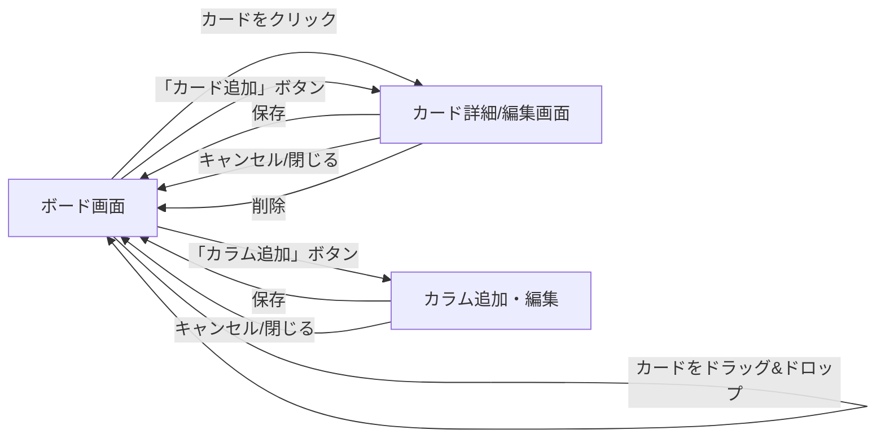
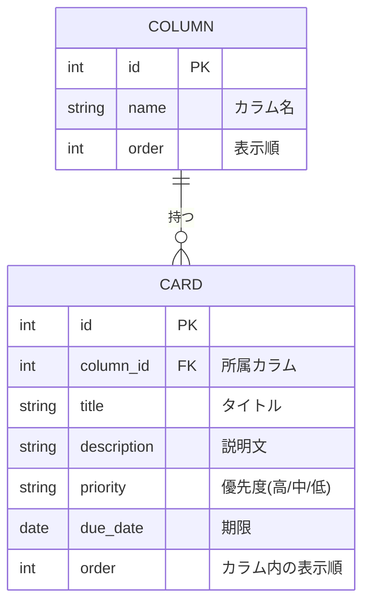

# 要件定義書 - Trello風タスク管理アプリ

## 1. 目的・背景

- 付箋やExcel等での進捗管理では、タスクの状況が見えづらく、対応漏れが発生しやすいという課題がある。
- この課題を解決する個人用タスク管理ツールを、スクールの学習課題として開発する。
- Webアプリケーションの一連の工程(要件定義・設計・実装・テスト)を実践し、フロントエンド・バックエンド・データベースを含む3層構成のアプリケーション開発スキルを習得することを目的とする。

## 2. 利用者(ユーザー)

- 開発者本人が個人で使用する。
- ログイン機能などマルチユーザーは想定しない(認証機能は不要)。

## 3. スコープ

### 3.1 対象範囲(やること)

- 下記「4. 機能要件」に記載する機能一式。

### 3.2 対象外(やらないこと)

- 通知機能(期限が近いことを知らせる等)
- 他サービス連携(Googleカレンダー等)
- 検索・フィルタ機能
- タグ・ラベル機能
- 複数ボード管理(ボードは1つのみ)
- モバイルアプリ化(ネイティブアプリ)
- マルチユーザー・認証機能

## 4. 機能要件

### 4.1 基本機能

| 機能 | 内容 |
|---|---|
| ボード | プロジェクト単位の作業スペース |
| カラム(リスト) | 「未着手」「進行中」「完了」など、カードを分類する列 |
| カード | 個々のタスクを表す単位 |
| ドラッグ&ドロップ | カードをカラム間でマウス操作により移動できる |

### 4.2 カード(タスク)が持つ情報

- タイトル
- 説明文
- 優先度(例:高・中・低)
- 期限(日付)

### 4.3 CRUD操作

- カードの作成・編集・削除
- カラムの作成・編集・削除

## 5. ユースケース

### 5.1 ユースケース一覧

| ID | ユースケース名 | 概要 |
|---|---|---|
| UC-01 | カラムを追加する | 新しいカラム(ステータス)をボードに追加する |
| UC-02 | カードを追加する | 指定したカラムに新しいカードを追加する |
| UC-03 | カードの詳細を編集する | カードのタイトル・説明文・優先度・期限を編集する |
| UC-04 | カードを別カラムへ移動する | ドラッグ&ドロップでカードのステータスを変更する |
| UC-05 | カードの並び順を変更する | 同一カラム内でカードの表示順を入れ替える |
| UC-06 | カードを削除する | 不要になったカードを削除する |
| UC-07 | カラムを削除する | 不要になったカラムを削除する |

### 5.2 基本フロー

**UC-01: カラムを追加する**
- アクター: 利用者
- トリガー: ボード画面で「カラム追加」ボタンをクリックする
- 基本フロー:
  1. 利用者が「カラム追加」ボタンをクリックする
  2. カラム名の入力欄が表示される
  3. 利用者がカラム名を入力し、保存する
  4. ボードに新しいカラムが追加される

**UC-02: カードを追加する**
- アクター: 利用者
- トリガー: カラム内の「カード追加」ボタンをクリックする
- 基本フロー:
  1. 利用者が対象カラムの「カード追加」ボタンをクリックする
  2. カード詳細(編集)画面が表示される
  3. 利用者がタイトル等を入力し、保存する
  4. 対象カラムの末尾に新しいカードが追加される

**UC-03: カードの詳細を編集する**
- アクター: 利用者
- トリガー: ボード画面上のカードをクリックする
- 基本フロー:
  1. 利用者がカードをクリックする
  2. カード詳細(編集)画面が表示される
  3. 利用者が内容を編集し、保存する
  4. 変更内容がカードに反映される

**UC-04: カードを別カラムへ移動する**
- アクター: 利用者
- トリガー: カードをドラッグして別カラムにドロップする
- 基本フロー:
  1. 利用者がカードをドラッグする
  2. 移動先のカラムにドロップする
  3. カードの所属カラムが更新される

**UC-05: カードの並び順を変更する**
- アクター: 利用者
- トリガー: 同一カラム内でカードをドラッグする
- 基本フロー:
  1. 利用者がカードをドラッグする
  2. 同一カラム内の別の位置にドロップする
  3. カードの表示順が更新される

**UC-06: カードを削除する**
- アクター: 利用者
- トリガー: カード詳細画面で「削除」ボタンをクリックする
- 基本フロー:
  1. 利用者が「削除」ボタンをクリックする
  2. 削除確認ダイアログが表示される
  3. 利用者が「削除する」を選択する
  4. カードが削除される

**UC-07: カラムを削除する**
- アクター: 利用者
- トリガー: カラムの「削除」操作を行う
- 基本フロー:
  1. 利用者がカラムの削除を選択する
  2. 削除確認ダイアログが表示される
  3. 利用者が「削除する」を選択する
  4. カラムとその中の全カードが削除される

## 6. 画面仕様

### 6.1 画面一覧

| 画面名 | 概要 |
|---|---|
| ボード画面 | アプリのメイン画面。カラムとカードの一覧・操作を行う。 |
| カード詳細(編集)画面 | カードのタイトル・説明文・優先度・期限を編集する。モーダル(ポップアップ)として表示。 |
| カラム追加・編集 | カラムの名称を作成・編集する。モーダルまたはインライン入力として表示。 |

### 6.2 画面遷移図



### 6.3 各画面の構成要素

**ボード画面**
- 複数のカラムが横並びで表示される。
- 各カラムの中にカードが縦に並ぶ。
- 各カラムの上部にカラム名と「カード追加」ボタンを表示する。
- ボード上部(または末尾)に「カラム追加」ボタンを表示する。
- カードには最低限、タイトルと優先度が一覧表示される。

**カード詳細(編集)画面**
- タイトル(テキスト入力)
- 説明文(複数行テキスト入力)
- 優先度(選択式:高・中・低)
- 期限(日付選択)
- 「保存」「削除」「閉じる」の操作ボタンを配置する。

### 6.4 ワイヤーフレーム

**ボード画面**

```
+--------------------------------------------------------------+
| タスク管理ボード                              [+ カラム追加] |
+--------------------------------------------------------------+
| 未着手         | 進行中         | 完了                       |
| [+ カード追加] | [+ カード追加] | [+ カード追加]              |
|----------------|----------------|-----------------------------|
| [カード1     ] | [カード3     ] | [カード5     ]              |
| 優先度:高      | 優先度:中      | 優先度:低                   |
|----------------|----------------|-----------------------------|
| [カード2     ] | [カード4     ] |                             |
| 優先度:中      | 優先度:高      |                             |
+--------------------------------------------------------------+
```

**カード詳細(編集)画面(モーダル)**

```
+--------------------------------------+
| カード詳細                      [x]  |
+--------------------------------------+
| タイトル   [______________________]  |
| 説明文     [______________________]  |
|            [______________________]  |
| 優先度     [ 高 ▼ ]                  |
| 期限       [ 2026/08/20 ]            |
|                                        |
|          [削除]      [保存]           |
+--------------------------------------+
```

**削除確認ダイアログ**

```
+----------------------------------+
| 確認                             |
+----------------------------------+
| このカードを削除しますか？        |
| この操作は取り消せません。        |
|                                    |
|        [キャンセル]   [削除する]  |
+----------------------------------+
```

### 6.5 操作仕様

- カードをドラッグして別のカラムにドロップすると、ステータス(カラム)が変わる。
- カードをクリックすると詳細(タイトル・説明文・優先度・期限)を編集できる。
- カラム・カードの削除時は、誤操作防止のため確認ダイアログを表示する。

## 7. 非機能要件

### 7.1 データ保存

- ブラウザやキャッシュ削除に依存せず、データを永続的に保存する。
- データベースを用いて永続化する。具体的な技術方式(DBの種類、サーバー構成等)は、本要件定義後の技術選定フェーズで決定する。

### 7.2 動作環境

- PCでの利用を中心とし、モダンブラウザ(Google Chrome等)で動作すること。
- Chrome以外のブラウザ(Edge、Firefox等)でも大きく崩れず動作することが望ましい。
- スマートフォン・タブレット等のレスポンシブ対応は対象外とする。

### 7.3 想定データ規模

- 個人利用のため、カード数は数十件程度の小規模な運用を想定する。
- 大量データ(数百〜数千件)を想定したパフォーマンス最適化は行わない。

### 7.4 セキュリティ

- 個人の学習用途のため、最低限の対策のみ意識する(例: 本番環境のURLを不用意に公開しない)。
- 認証機能を持たないため、複数人利用や機密情報の管理は想定しない。

## 8. データ設計

### 8.1 ER図



### 8.2 補足

- ボードは1つのみのため、ボードをエンティティとしては持たない(カラム・カードのみで管理する)。
- カード・カラムそれぞれに表示順(`order`)を持たせ、ドラッグ&ドロップによる並べ替えを可能にする。
- カードは必ずいずれか1つのカラムに属する(1カラム:多カード)。

## 9. 技術スタック

- 本要件定義書の確定後、別途「技術選定」フェーズで決定する。
- フロントエンドは HTML / CSS / JavaScript を基本とする方向性のみ現時点で決めている。
