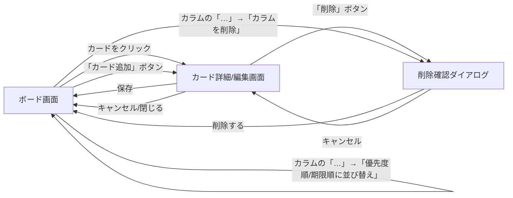

# 画面設計 - Trello風タスク管理アプリ

[要件定義書](requirements.md) に対応する画面設計詳細ドキュメント。

## 1. 画面一覧

| 画面名 | 概要 |
|---|---|
| ボード画面 | アプリのメイン画面。カラムとカードの一覧・操作を行う。 |
| カード詳細(編集)画面 | カードのタイトル・説明文・優先度・期限を編集する。モーダル(ポップアップ)として表示。 |
| 削除確認ダイアログ | カード・カラム削除前に、誤操作防止のため確認を行う。モーダルとして表示。 |

## 2. 画面遷移図



- 削除確認ダイアログの「キャンセル」は、呼び出し元の画面(カード詳細画面 または ボード画面)に戻る。

## 3. 各画面の構成要素

**ボード画面**
- 複数のカラムが横並びで表示される。
- 各カラムの中にカードが縦に並ぶ。
- 各カラムの上部にカラム名・カード件数・「…」メニューボタン・「カード追加」ボタンを表示する。
- カラム名の横にそのカラムに含まれるカードの合計件数を表示する。
- 「…」メニューボタンをクリックすると「名前を変更」「優先度順に並び替え」「期限順に並び替え」「カラムを削除」の選択肢を表示する(Trelloに準拠)。
- 「名前を変更」を選択するとカラム名がその場でテキスト編集可能になる(インライン編集)。
- 「優先度順に並び替え」「期限順に並び替え」を選択すると、カラム内のカードが一括で並び替えられる。並び替え後もドラッグ&ドロップによる自由な並び替えは可能。
- ボード上部に「カラム追加」ボタンを1箇所のみ表示する。
- 「カラム追加」ボタンをクリックすると、ボード末尾にカラム名の入力欄が表示される(インライン入力)。
- カードには最低限、タイトルと優先度が一覧表示される。

**カード詳細(編集)画面**
- タイトル(テキスト入力)
- 説明文(複数行テキスト入力)
- 優先度(選択式:高・中・低)
- 期限(日付選択)
- 「保存」「削除」「閉じる」の操作ボタンを配置する。

**削除確認ダイアログ**
- 削除対象(カードまたはカラム)の確認メッセージを表示する。
- 「キャンセル」「削除する」の操作ボタンを配置する。

## 4. ワイヤーフレーム

**ボード画面**

```
+--------------------------------------------------------------+
| タスク管理ボード                              [+ カラム追加] |
+--------------------------------------------------------------+
| 未着手 (2) [...] | 進行中 (2) [...] | 完了 (1)   [...]        |
| [+ カード追加]   | [+ カード追加]   | [+ カード追加]          |
|------------------|------------------|--------------------------|
| [カード1      ]  | [カード3      ]  | [カード5      ]         |
| 優先度:高        | 優先度:中        | 優先度:低               |
|------------------|------------------|--------------------------|
| [カード2      ]  | [カード4      ]  |                          |
| 優先度:中        | 優先度:高        |                          |
+--------------------------------------------------------------+

  (n) はそのカラムのカード件数
  [...] クリックで「名前を変更」「優先度順に並び替え」「期限順に並び替え」
        「カラムを削除」メニューを表示
```

**カード詳細(編集)画面(モーダル)**

```
+--------------------------------------+
| カード詳細                      [x]  |
+--------------------------------------+
| タイトル   [______________________]  |
| 説明文     [______________________]  |
|            [______________________]  |
| 優先度     [ 高 ▼ ]                  |
| 期限       [ 2026/08/20 ]            |
|                                        |
|          [削除]      [保存]           |
+--------------------------------------+
```

**削除確認ダイアログ**

```
+----------------------------------+
| 確認                             |
+----------------------------------+
| このカードを削除しますか？        |
| この操作は取り消せません。        |
|                                    |
|        [キャンセル]   [削除する]  |
+----------------------------------+
```

## 5. 操作仕様

- カードをドラッグして別のカラムにドロップすると、ステータス(カラム)が変わる。
- カードをクリックすると詳細(タイトル・説明文・優先度・期限)を編集できる。
- カラム・カードの削除時は、誤操作防止のため確認ダイアログを表示する。
- カラムの「…」メニューから、カラム内のカードを優先度順・期限順に一括で並び替えられる。
